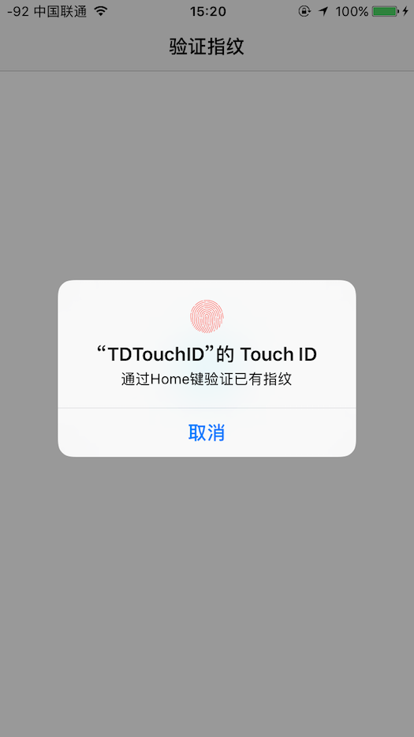

# TDTouchID

TDTouchID是一个封装好的指纹验证、人脸验证库,可以用来做iOSAPP的登录/支付等验证。


#安装方式
使用Cocoa Pods安装
```
pod 'TDTouchID', '~> 1.0.4'

```
手动导入      

下载本项目,导入子层`TDTouchID`文件夹.(里面包含`TDTouchID.h`和`TDTouchID.m`)文件

* 导入`#import "TDTouchID.h"`即可使用 

哎，真香


#如何使用
```
/**
 启动生物验证

 @param desc Touch显示的描述
 @param block 回调状态的block
 */
- (void)td_showTouchIDWithDescribe:(NSString *)desc BlockState:(StateBlock)block;

/**
 启动生物验证
 @param desc Touch显示的描述
 @param faceDesc FaceID状态下显示的描述
 @param block 回调状态的block
 */
- (void)td_showTouchIDWithDescribe:(NSString *)desc FaceIDDescribe:(NSString *)faceDesc BlockState:(StateBlock)block;

// 判断设备支持哪种认证方式 TouchID & FaceID
- (TDTouchIDSupperType)td_canSupperBiometrics;

```

```
    //判断是否支持生物验证(此处根据不同类型来显示不同的图标)
    TDTouchIDSupperType type = [[TDTouchID sharedInstance] td_canSupperBiometrics];
    switch (type) {
        case TDTouchIDSupperTypeFaceID:
            NSLog(@"😄支持FaceID");
            break;
        case TDTouchIDSupperTypeTouchID:
            NSLog(@"😄支持TouchID");
            break;
        case TDTouchIDSupperTypeNone:
            NSLog(@"😭不支持生物验证");
            break;
        default:
            break;
    }
```

```
[[TDTouchID sharedInstance] td_showTouchIDWithDescribe:@"通过Home键验证已有指纹" FaceIDDescribe:@"通过已有面容ID验证" BlockState:^(TDTouchIDState state, NSError *error) {
        if (state == TDTouchIDStateNotSupport) {    //不支持TouchID/FaceID
            
            UIAlertView *alertview = [[UIAlertView alloc] initWithTitle:@"当前设备不支持生物验证" message:@"请输入密码来验证" delegate:nil cancelButtonTitle:@"确定" otherButtonTitles:nil];
            alertview.alertViewStyle = UIAlertViewStyleSecureTextInput;
            [alertview show];
            
        } else if (state == TDTouchIDStateSuccess) {    //TouchID/FaceID验证成功
            
            NSLog(@"jump");
            TDHomeViewController *homeVc = [[TDHomeViewController alloc] init];
            [self.navigationController pushViewController:homeVc animated:YES];
            
        } else if (state == TDTouchIDStateInputPassword) { //用户选择手动输入密码
            
            UIAlertView *alertview = [[UIAlertView alloc] initWithTitle:nil message:@"请输入密码" delegate:nil cancelButtonTitle:@"确定" otherButtonTitles:nil];
            alertview.alertViewStyle = UIAlertViewStyleSecureTextInput;
            [alertview show];
            
        }
        
        // ps:以上的状态处理并没有写完全!
        // 在使用中你需要根据回调的状态进行处理,需要处理什么就处理什么
        
    }];
```

详细使用方法参见Demo即可
